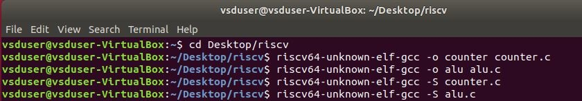
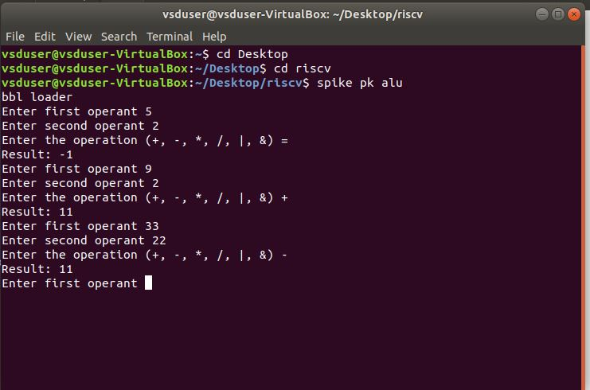
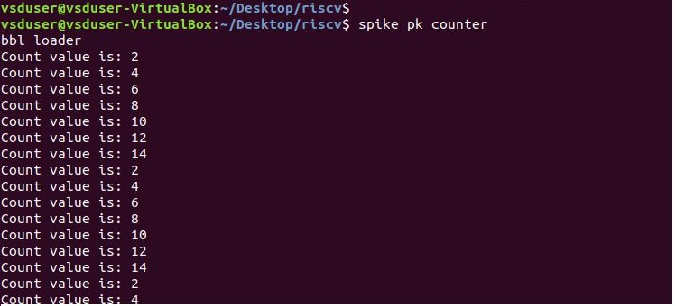

# Project Title

- TASKS
    - Verify all the c code (counter, matrix multiplication, ALU code using RISC-V compiler and spike output.
    - Measure CPU performance of all the programs mentioned above using either godbolt or RISC-V disassembler. 

## COMPILATION WITH RISC-V COMPILER

Compiling Codes with RISC-V Compiler and generating assembly outputs
 

- Generated files are the followings:
    - counter.s (assembly code)
    - counter   (spike output)
    - alu.s 
    - alu 

Running compiled programs with spike

 


 
 
 
 ## MEASURING CPU PERFORMANCE
 In this part counter program which does not have printf function
 C code is given below:
 ```
 
int main()
{
	int count = 0x00000002;
	while (1){
	
	count++;
        count++;
        if(count==16){
            count=2;
        }
	}
}

```
 Assembly code is given below
```
 	.file	"counter.c"
	.option nopic
	.attribute arch, "rv64i2p0_m2p0_a2p0_f2p0_d2p0_c2p0"
	.attribute unaligned_access, 0
	.attribute stack_align, 16
	.text
	.align	1
	.globl	main
	.type	main, @function
main:
	addi	sp,sp,-32
	sd	s0,24(sp)
	addi	s0,sp,32
	li	a5,2
	sw	a5,-20(s0)
.L3:
	lw	a5,-20(s0)
	addiw	a5,a5,1
	sw	a5,-20(s0)
	lw	a5,-20(s0)
	addiw	a5,a5,1
	sw	a5,-20(s0)
	lw	a5,-20(s0)
	sext.w	a4,a5
	li	a5,16
	bne	a4,a5,.L3
	li	a5,2
	sw	a5,-20(s0)
	j	.L3
	.size	main, .-main
	.ident	"GCC: (SiFive GCC 8.3.0-2019.08.0) 8.3.0"

```
Below,clock cycle of each instruction is given (these are assumptions, since it depends on the implementation)
```
main:
	addi	sp,sp,-32    (4 cycle)
	sd	s0,24(sp	     (3 cycle)
	addi	s0,sp,32     (4 cycle)
	li	a5,2			 (2 cycle)
	sw	a5,-20(s0)       (5 cycle)
.L3:
	lw	a5,-20(s0)		 (5 cycle)
	addiw	a5,a5,1		 (8 cycle)
	sw	a5,-20(s0)	     (5 cycle)
	lw	a5,-20(s0)       (2 cycle)
	addiw	a5,a5,1		 (8 cycle)
	sw	a5,-20(s0)		 (5 cycle)
	lw	a5,-20(s0)		 (2 cycle)
	sext.w	a4,a5		 (9 cycle)
	li	a5,16			 (2 cycle)
	bne	a4,a5,.L3        (2 cycle)
	li	a5,2			 (2 cycle)
	sw	a5,-20(s0)		 (5 cycle)
	j	.L3			     (2 cycle)
```
total clock cycle = 75 clock cycle

number of instruction = 18 

CPI(clock cycles per instruction) = total clock cycle / number of instructions

CPU time = total clock cycle x Clock cycle time

CPI = 4.16

Assume Clock frequency is 100 MHz, so clock cycle time is 10 ns,

CPU time = 75 x 10 ns = 750 ns

 
 