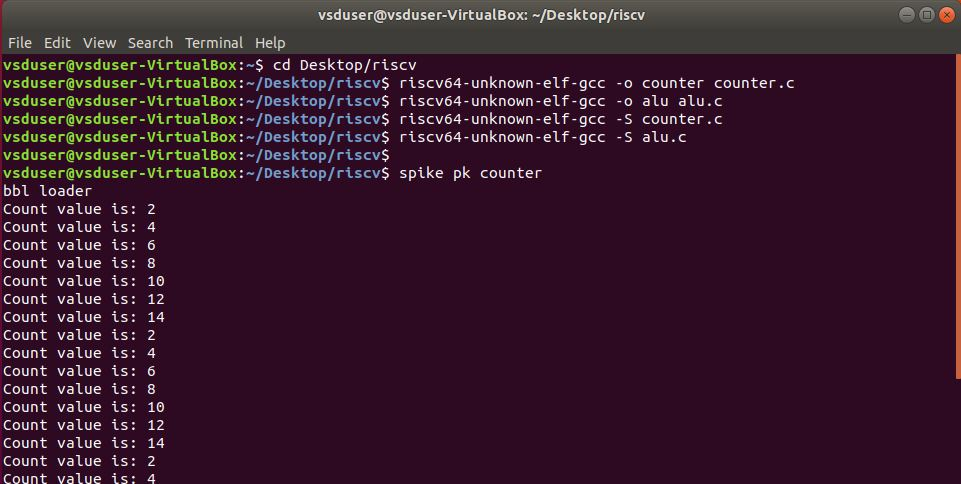

#  WEEK 2 TASK 3

 

- TASKS

    - Verify all the c code (counter, matrix multiplication, ALU code using RISC-V compiler and spike output.

    - Measure CPU performance of all the programs mentioned above using either godbolt or RISC-V disassembler. 

 

