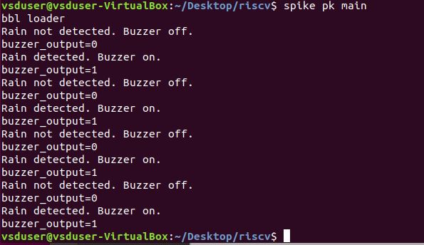

# RAIN DETECTION SYSTEM
This project implements a simple rain alert system. System has chipcrone risc-v cpu. It reads the moisture sensor and rings the buzzer if it is raining.
## FLOW CHART
 
 
 ## REGISTER MAPPING
 

 ## C Code
```
//#include <stdio.h>
//#include <stdlib.h>
int main(){
	int rain_input;	
	int buzzer_output=0; 
	int buzzer_reg;
	int i;
	int mask =0xFFFFFFFD;
	buzzer_reg = buzzer_output*2;


	asm volatile(
	"and x30, x30, %1\n\t"
    	"or x30, x30, %0\n\t"  
    	:
    	: "r" (buzzer_reg), "r"(mask)
	: "x30" 
	);
	// rain_input=0;
	// for(i=0;i<8;i++)
	while(1)
	{	
		asm volatile(
		"andi %0, x30, 0x01\n\t"
		: "=r" (rain_input)
		:
		:);
       
	if (rain_input)
	{
		buzzer_output = 1; 
		
		buzzer_reg = buzzer_output*2;
		
		asm volatile(
		"and x30,x30, %1\n\t"  
		"or x30, x30, %0\n\t"   
		:
		: "r" (buzzer_reg), "r"(mask)
		: "x30" 
		);
 		//printf("Rain detected. Buzzer on.\n");
  		//printf("buzzer_output=%d \n", buzzer_output);
		// rain_input=0; 
		
	}	
	
	else
	{
		buzzer_output = 0;
		
		buzzer_reg = buzzer_output*2;

		asm volatile(
		"and x30,x30, %1\n\t"
		"or x30,x30, %0\n\t"
		:
		: "r"(buzzer_reg), "r"(mask)
		: "x30"
		);

		//printf("Rain not detected. Buzzer off.\n");
		//printf("buzzer_output=%d \n", buzzer_output);
		// rain_input=1; 
	}
	}

	return 0;

}
```

 ## testing c code
 

```
Number of different instructions: 9
List of unique instructions:
addi
j
andi
lw
beq
ori
sw
li
and
```

## Modifying the Processor for GPIO 
```
    always @(posedge clk) 
    begin
    output_pins = {30'b0, top_gpio_pins[1:1],  input_gpio_pins} ; 
    output_gpio_pins = top_gpio_pins[1:1]; 
    write_done = writing_inst_done ; 
    instructions = write_inst_count[2:0]; 

    end 
```
## Modifying the Testbench for input 
```
always @(posedge clk)
#4430 input_wires = ~input_wires;
```


 
