# RAIN DETECTION SYSTEM
This project implements a simple rain alert system. System has chipcrone risc-v cpu. It reads the moisture sensor and rings the buzzer if it is raining.
## FLOW CHART
 
 
 ## REGISTER MAPPING
 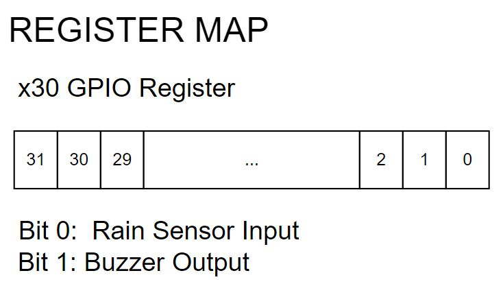

 ## C Code
```
//#include <stdio.h>
//#include <stdlib.h>
int main(){
	int rain_input;	
	int buzzer_output=0; 
	int buzzer_reg;
	int i;
	int mask =0xFFFFFFFD;
	buzzer_reg = buzzer_output*2;


	asm volatile(
	"and x30, x30, %1\n\t"
    	"or x30, x30, %0\n\t"  
    	:
    	: "r" (buzzer_reg), "r"(mask)
	: "x30" 
	);
	// rain_input=0;
	// for(i=0;i<8;i++)
	while(1)
	{	
		asm volatile(
		"andi %0, x30, 0x01\n\t"
		: "=r" (rain_input)
		:
		:);
       
	if (rain_input)
	{
		buzzer_output = 1; 
		
		buzzer_reg = buzzer_output*2;
		
		asm volatile(
		"and x30,x30, %1\n\t"  
		"or x30, x30, %0\n\t"   
		:
		: "r" (buzzer_reg), "r"(mask)
		: "x30" 
		);
 		//printf("Rain detected. Buzzer on.\n");
  		//printf("buzzer_output=%d \n", buzzer_output);
		// rain_input=0; 
		
	}	
	
	else
	{
		buzzer_output = 0;
		
		buzzer_reg = buzzer_output*2;

		asm volatile(
		"and x30,x30, %1\n\t"
		"or x30,x30, %0\n\t"
		:
		: "r"(buzzer_reg), "r"(mask)
		: "x30"
		);

		//printf("Rain not detected. Buzzer off.\n");
		//printf("buzzer_output=%d \n", buzzer_output);
		// rain_input=1; 
	}
	}

	return 0;

}
```
## assembly code
```
00010054 <main>:
   10054:	fe010113          	addi	sp,sp,-32
   10058:	00812e23          	sw	s0,28(sp)
   1005c:	02010413          	addi	s0,sp,32
   10060:	fe042623          	sw	zero,-20(s0)
   10064:	ffd00793          	li	a5,-3
   10068:	fef42423          	sw	a5,-24(s0)
   1006c:	fec42783          	lw	a5,-20(s0)
   10070:	00179793          	slli	a5,a5,0x1
   10074:	fef42223          	sw	a5,-28(s0)
   10078:	fe442783          	lw	a5,-28(s0)
   1007c:	fe842703          	lw	a4,-24(s0)
   10080:	00ef7f33          	and	t5,t5,a4
   10084:	00ff6f33          	or	t5,t5,a5
   10088:	001f7793          	andi	a5,t5,1
   1008c:	fef42023          	sw	a5,-32(s0)
   10090:	fe042783          	lw	a5,-32(s0)
   10094:	02078663          	beqz	a5,100c0 <main+0x6c>
   10098:	00100793          	li	a5,1
   1009c:	fef42623          	sw	a5,-20(s0)
   100a0:	fec42783          	lw	a5,-20(s0)
   100a4:	00179793          	slli	a5,a5,0x1
   100a8:	fef42223          	sw	a5,-28(s0)
   100ac:	fe442783          	lw	a5,-28(s0)
   100b0:	fe842703          	lw	a4,-24(s0)
   100b4:	00ef7f33          	and	t5,t5,a4
   100b8:	00ff6f33          	or	t5,t5,a5
   100bc:	fcdff06f          	j	10088 <main+0x34>
   100c0:	fe042623          	sw	zero,-20(s0)
   100c4:	fec42783          	lw	a5,-20(s0)
   100c8:	00179793          	slli	a5,a5,0x1
   100cc:	fef42223          	sw	a5,-28(s0)
   100d0:	fe442783          	lw	a5,-28(s0)
   100d4:	fe842703          	lw	a4,-24(s0)
   100d8:	00ef7f33          	and	t5,t5,a4
   100dc:	00ff6f33          	or	t5,t5,a5
   100e0:	fa9ff06f          	j	10088 <main+0x34>
```
 ## testing c code
 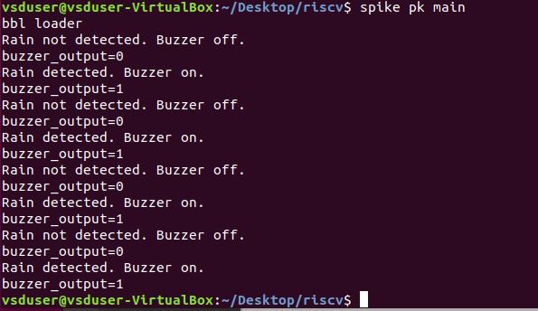

```
Number of different instructions: 9
List of unique instructions:
addi
j
andi
lw
beq
ori
sw
li
and
```

## Modifying the Processor for GPIO 
```
    always @(posedge clk) 
    begin
    output_pins = {30'b0, top_gpio_pins[1:1],  input_gpio_pins} ; 
    output_gpio_pins = top_gpio_pins[1:1]; 
    write_done = writing_inst_done ; 
    instructions = write_inst_count[2:0]; 

    end 
```
## Modifying the Testbench for input 
```
always @(posedge clk)
#4430 input_wires = ~input_wires;
```
## Functional Simulation
 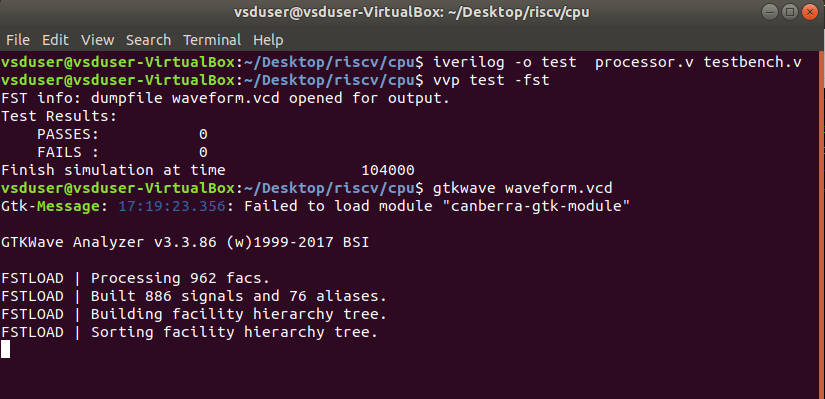

## GTKWave Simulation
It can be seen that our code's instructions are fetch one by one. 
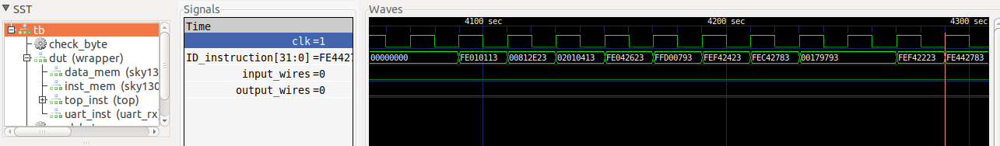
When the input is high, means it's raining, the buzzer output sets high.
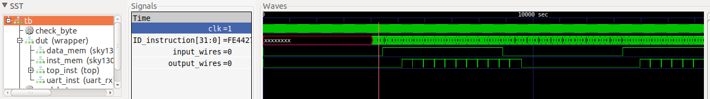
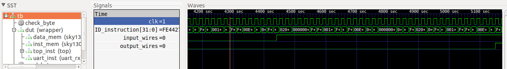
00ff6f33  (or t5,t5,a5) -> this instruction sets the output high. t5 is x30 register.
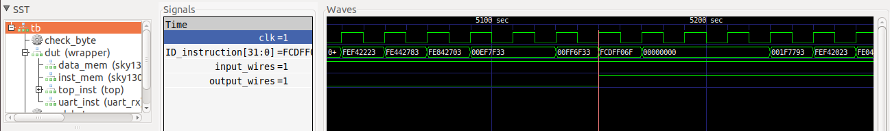
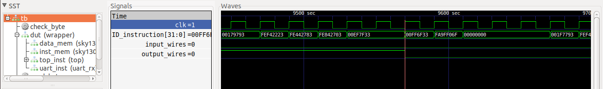


 ## Gate Level Simulation
Leave the instruction memory and remove the data memory module in the processsor.v
```
yosys> read_liberty -lib sky130_fd_sc_hd__tt_025C_1v80_256.lib
yosys> read_verilog processor.v
yosys> synth -top wrapper
yosys> dfflibmap -liberty sky130_fd_sc_hd__tt_025C_1v80_256.lib
yosys> abc -liberty sky130_fd_sc_hd__tt_025C_1v80_256.lib
yosys> write_verilog synth_output.v
```

We can see the modules. 
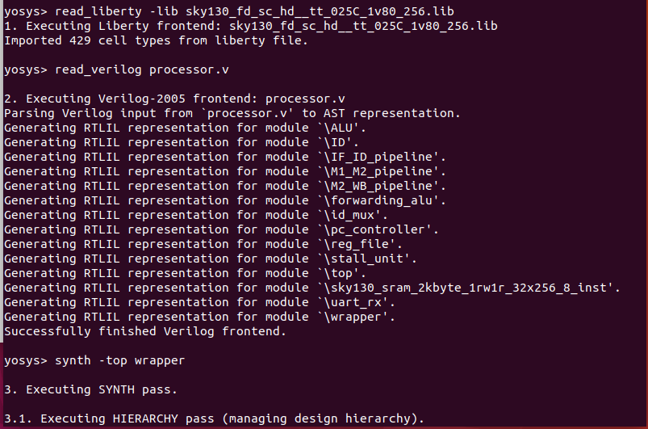

Below the resources are used listed.
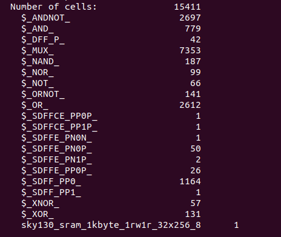
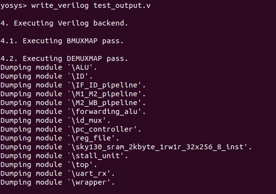


```
iverilog -o test testbench_asic.v synth_output.v sky130_sram_1kbyte_1rw1r_32x256_8.v sky130_fd_sc_hd.v primitives.v
vvp test -fst
gtkwave waveform.vcd
```

 
